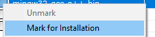
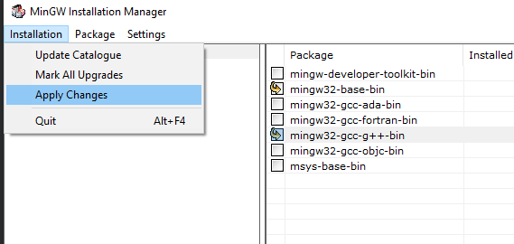
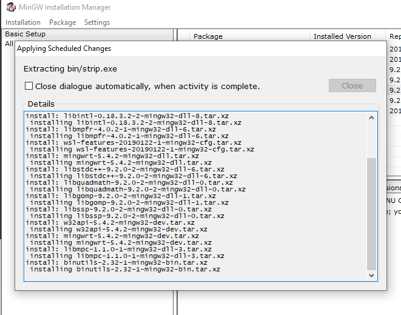
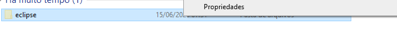

# Instalação

#### Instalação

* o que é preciso
* Compilador C
* IDE
* Instalar, configurar e remover programas
* adicionar binários no path do sistema
* adicionar variáveis de ambiente no path do sistema

\*Os arquivos necessários estão na pasta Instalação no drive:

#### Passo a Passo:

1. Instalar Java (jdk)

* Link para instalar:



1. Instalar MingGW





* Decorar o caminho do diretório (C:\MinGW)
* Após instalar, selecionar esses dois campos, marcando-os para instalação:

<figure><figcaption></figcaption></figure>

<figure><figcaption></figcaption></figure>

* Após isso espere a instalção terminar e apóis isso é só fechar

<figure><figcaption></figcaption></figure>

3. Instalar eclipse

* Link para download:



* Escolha a opção que deseja, nesse caso é C

<figure><figcaption></figcaption></figure>

* Instale e aceite os termos&#x20;

<figure><figcaption></figcaption></figure>

* Por último, é só iniciar

<figure><figcaption></figcaption></figure>

* Após extrair o arquivo, recorte ele e, na pasta C e no seu usuário&#x20;
* crie uma past chamada apps e em seguida cole o arquivo do eclipse

<figure><figcaption></figcaption></figure>

<figure><figcaption></figcaption></figure>

<figure><figcaption></figcaption></figure>

<figure><figcaption></figcaption></figure>

<figure><figcaption></figcaption></figure>

* Para executar, basta dar um clique duplo

<figure><figcaption></figcaption></figure>

\
\
\
